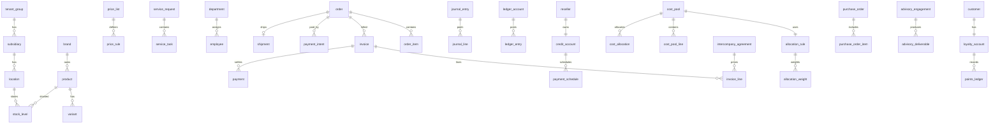

# ERD Outline - HoldCo Unified Backend

This document outlines a logical ERD for the unified backend (NestJS + Postgres). It focuses on table groups, key fields, and relationships. All tenant scoped tables include group_id, subsidiary_id, and optional location_id unless noted.

## Tenancy and access
Tables
- tenant_group: id, name, status
- subsidiary: id, group_id, name, status
- location: id, subsidiary_id, type (store, warehouse), name, address
- user: id, email, name, status
- role: id, name, scope (group or subsidiary)
- permission: id, code, description
- user_role: user_id, role_id, subsidiary_id, location_id
- role_permission: role_id, permission_id

Relationships
- tenant_group 1..* subsidiary
- subsidiary 1..* location
- user *..* role via user_role
- role *..* permission via role_permission

## Catalog
Tables
- brand: id, name
- supplier: id, name, contact_name, contact_phone
- product: id, brand_id, name, sku, type, sex, concentration, status
- variant: id, product_id, size, unit, barcode
- facet_definition: id, key, name, scope, data_type, status
- facet_value: id, facet_id, value, normalized_value
- product_facet: id, product_id, facet_value_id
- variant_facet: id, variant_id, facet_value_id
- batch: id, product_id, code, expires_at
- lot: id, batch_id, quantity

Relationships
- brand 1..* product
- product 1..* variant
- facet_definition 1..* facet_value
- facet_value *..* product via product_facet
- facet_value *..* variant via variant_facet
- product 1..* batch 1..* lot

## Inventory
Tables
- stock_level: id, product_id, variant_id, location_id, on_hand, reserved
- stock_adjustment: id, product_id, variant_id, location_id, quantity, reason, created_by
- stock_transfer: id, product_id, variant_id, from_location_id, to_location_id, quantity, status
- stock_reservation: id, order_id, product_id, variant_id, location_id, quantity, status

Relationships
- location 1..* stock_level
- product 1..* stock_level
- order 1..* stock_reservation

## Pricing and promotions
Tables
- price_list: id, name, currency, channel, valid_from, valid_to
- price_rule: id, price_list_id, product_id, variant_id, min_qty, price
- promotion: id, code, type, value, start_at, end_at

Relationships
- price_list 1..* price_rule

## Orders and payments
Tables
- cart: id, customer_id, status
- cart_item: id, cart_id, product_id, variant_id, quantity, unit_price
- order: id, order_no, customer_id, reseller_id, status, total_amount, currency
- order_item: id, order_id, product_id, variant_id, quantity, unit_price, total_price
- invoice: id, order_id, invoice_type, status, seller_company_id, buyer_company_id, period, issue_date, due_date, subtotal, vat_amount, total_amount, is_credit_note, related_invoice_id
- invoice_line: id, invoice_id, agreement_id, description, net_amount, vat_rate, vat_amount, wht_rate, wht_amount, gross_amount
- payment: id, invoice_id, payer_company_id, payee_company_id, payment_date, amount_paid, wht_withheld_amount, reference, notes
- payment_intent: id, order_id, amount, currency, status, provider, reference
- refund: id, payment_intent_id, amount, reason, status
- return: id, order_id, status, reason

Relationships
- order 1..* order_item
- order 0..* invoice
- invoice 1..* invoice_line
- invoice 0..* payment
- order 1..* payment_intent 0..* refund

## Credit and collections
Tables
- reseller: id, name, status
- credit_account: id, reseller_id, limit_amount, used_amount, status
- payment_schedule: id, credit_account_id, due_date, amount, status
- repayment: id, credit_account_id, amount, paid_at, method

Relationships
- reseller 1..1 credit_account
- credit_account 1..* payment_schedule
- credit_account 1..* repayment

## Loyalty
Tables
- customer: id, name, email, phone
- loyalty_account: id, customer_id, points_balance
- points_ledger: id, loyalty_account_id, points, reason, created_at
- campaign: id, name, start_at, end_at

Relationships
- customer 1..1 loyalty_account
- loyalty_account 1..* points_ledger

## Shared services (holding company)
Tables
- external_client: id, name, type (client, vendor, partner), email, phone, status
- service_request: id, subsidiary_id, external_client_id, category, title, status, priority, assigned_to, approved_by, approved_at, rejected_by, rejected_at, reason, due_at
- service_task: id, service_request_id, title, status, assigned_to, due_at

Relationships
- subsidiary 0..* service_request
- external_client 0..* service_request
- service_request 1..* service_task

## Human resources
Tables
- department: id, name, code, status
- position: id, title, level, status
- employee: id, employee_no, user_id, department_id, position_id, status, hired_at, terminated_at
- leave_request: id, employee_id, type, start_date, end_date, status, reason

Relationships
- department 1..* employee
- position 1..* employee
- employee 1..* leave_request

## Finance and accounting
Tables
- cost_center: id, code, name, status
- chart_of_account: id, code, name, type, parent_id
- fiscal_period: id, name, start_date, end_date, status
- journal_entry: id, fiscal_period_id, reference, status, posted_at
- journal_line: id, journal_entry_id, account_id, cost_center_id, debit, credit
- ledger_account: id, company_id, code, name, type
- ledger_entry: id, company_id, period, entry_date, account_id, debit, credit, memo, source_type, source_ref
- cost_pool: id, company_id, period, total_cost
- cost_pool_line: id, cost_pool_id, category, amount
- allocation_rule: id, cost_pool_id, method
- allocation_weight: id, allocation_rule_id, recipient_company_id, weight
- cost_allocation: id, cost_pool_id, recipient_company_id, allocated_cost
- intercompany_agreement: id, provider_company_id, recipient_company_id, type, pricing_model, markup_rate, fixed_fee_amount, vat_applies, vat_rate, wht_applies, wht_rate, wht_tax_type, effective_from, effective_to
- wht_credit_note: id, issuer_company_id, beneficiary_company_id, period, tax_type, amount, remittance_date, fir_receipt_ref
- vat_return: id, company_id, period, output_vat, input_vat, net_vat_payable, status, filed_at, payment_ref
- period_lock: id, company_id, period, locked, locked_at, locked_by, reason

Relationships
- chart_of_account 1..* journal_line
- journal_entry 1..* journal_line
- cost_center 0..* journal_line
- ledger_account 1..* ledger_entry
- cost_pool 1..* cost_pool_line
- cost_pool 1..1 allocation_rule 1..* allocation_weight
- cost_pool 1..* cost_allocation
- intercompany_agreement 1..* invoice_line

## Compliance and risk
Tables
- compliance_policy: id, title, version, status, effective_at, review_at, owner_id
- compliance_task: id, policy_id, title, status, due_at, assignee_id
- risk_register_item: id, title, category, likelihood, impact, score, status, owner_id
- compliance_audit: id, title, scope, status, started_at, completed_at, lead_auditor_id
- audit_finding: id, compliance_audit_id, severity, description, status, remediation_due_at, assignee_id

Relationships
- compliance_policy 0..* compliance_task
- compliance_audit 1..* audit_finding

## Procurement coordination
Tables
- purchase_request: id, requester_id, status, requested_at, needed_by
- purchase_request_item: id, purchase_request_id, description, quantity, unit, estimated_unit_cost
- purchase_order: id, vendor_id, status, ordered_at, expected_at, total_amount, currency
- purchase_order_item: id, purchase_order_id, description, quantity, unit_price, total_price

Relationships
- purchase_request 1..* purchase_request_item
- purchase_order 1..* purchase_order_item
- external_client 0..* purchase_order

## Business advisory
Tables
- advisory_engagement: id, external_client_id, title, scope, status, start_at, end_at, lead_id
- advisory_deliverable: id, advisory_engagement_id, title, status, due_at, delivered_at

Relationships
- advisory_engagement 1..* advisory_deliverable
- external_client 0..* advisory_engagement

## Logistics (optional)
Tables
- shipment: id, order_id, carrier, status, tracking_no
- delivery_slot: id, shipment_id, start_at, end_at
- proof_of_delivery: id, shipment_id, signed_by, received_at

Relationships
- order 0..1 shipment
- shipment 0..* proof_of_delivery

## Reporting and audit
Tables
- audit_log: id, actor_id, action, entity_type, entity_id, payload, created_at
- event_outbox: id, aggregate_type, aggregate_id, event_type, payload, status, created_at
- event_inbox: id, consumer_name, event_id, processed_at
- external_system: id, name
- external_id_map: id, external_system_id, external_id, entity_type, entity_id

Relationships
- external_system 1..* external_id_map

## Mermaid overview

## Indexes and constraints
- Unique: product.sku, order.order_no, price_list.name + channel, loyalty_account.customer_id
- Composite: stock_level(product_id, variant_id, location_id)
- Foreign keys on all *_id columns with cascade rules defined per domain
- Partition large fact tables (order_item, points_ledger, audit_log) by created_at as needed
- Finance indexes: ledger_entry(company_id, period), wht_credit_note(issuer_company_id, period), intercompany_agreement(provider_company_id)
