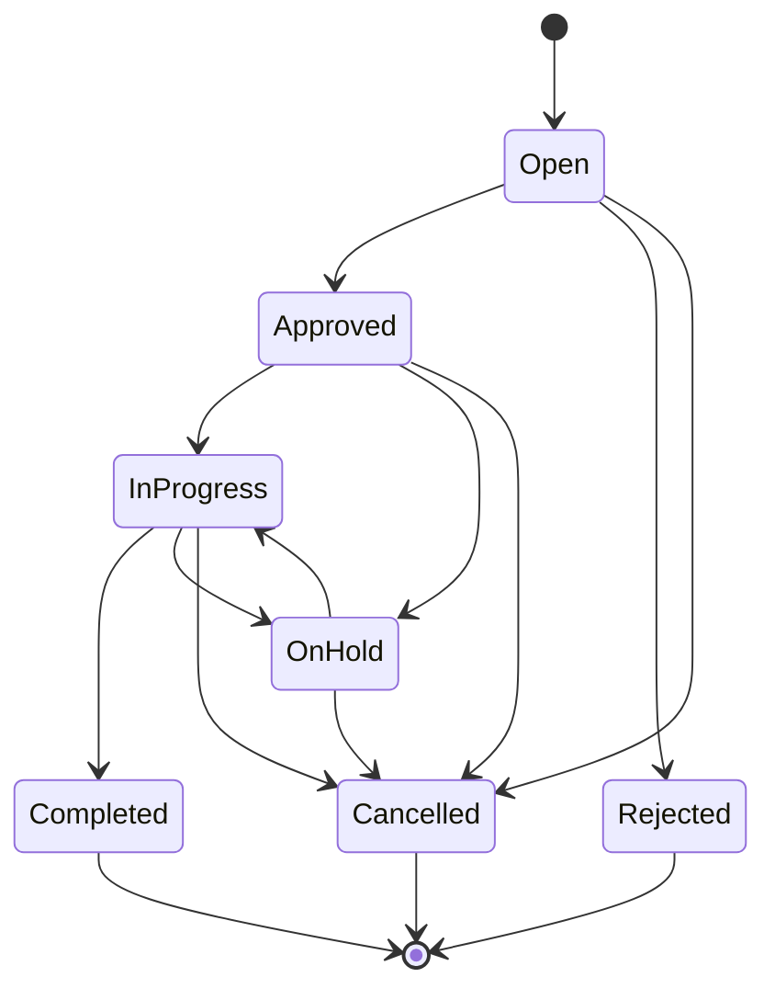

# Shared Services Workflows

This document captures the lifecycle and approval flow for shared-services requests (management, admin, finance, HR, compliance, risk, procurement, advisory).

## Status lifecycle
Allowed statuses (see `ServiceRequestStatus`):
- `open`: request submitted and awaiting triage/approval.
- `approved`: approved for execution.
- `rejected`: rejected and closed.
- `in_progress`: actively being worked on.
- `on_hold`: paused awaiting input or dependency.
- `completed`: work finished and delivered.
- `cancelled`: requester or manager cancelled the request.

## Status transitions
- `open` -> `approved` | `rejected` | `cancelled`
- `approved` -> `in_progress` | `on_hold` | `cancelled`
- `in_progress` -> `on_hold` | `completed` | `cancelled`
- `on_hold` -> `in_progress` | `cancelled`
- `rejected` -> terminal
- `completed` -> terminal
- `cancelled` -> terminal

## Approvals
- Approval required for categories: `financial`, `accounting`, `auditing`, `compliance`, `risk_management`, `procurement`.
- Optional approval for other categories based on group policy.
- Approval actions:
  - Approve: `POST /v1/shared-services/requests/{service_request_id}/approve`
  - Reject: `POST /v1/shared-services/requests/{service_request_id}/reject`

## Assignment and execution
- Assign owner: `POST /v1/shared-services/requests/{service_request_id}/assign`
- Start work: `POST /v1/shared-services/requests/{service_request_id}/start`
- Complete work: `POST /v1/shared-services/requests/{service_request_id}/complete`
- Cancel: `POST /v1/shared-services/requests/{service_request_id}/cancel`

## Workflow diagram (Mermaid)

## SLA and due dates
- Use `priority` + `due_at` to drive SLAs.
- `urgent` requests should trigger alerts and escalation to managers.

## Audit and compliance
- All transitions should write to `audit_logs`.
- Approvals should capture approver ID and timestamp in the request history.
